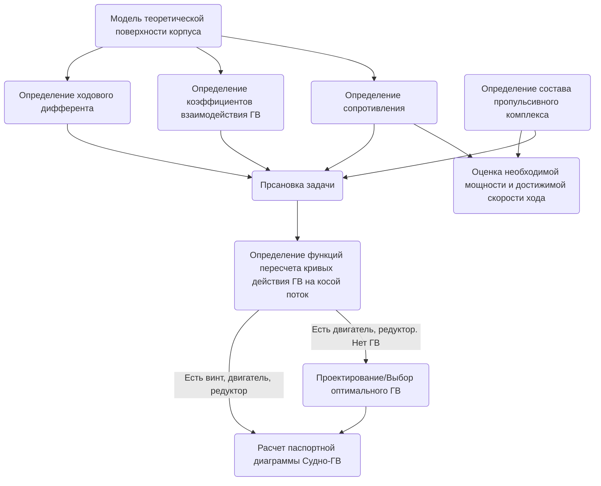

# Расчетная схема

```mermaid
flowchart TD
t4 --> TrimCurve("Определение ходового дифферента")
t4 --> PropultionFactor("Определение коэффициентов взаимодействия ГВ")
ResistanceCurve --> WhatTask
t4("Модель теоретической поверхности корпуса") --> ResistanceCurve("Определение сопротивления") 
TrimCurve --> WhatTask
PropultionFactor --> WhatTask

ResistanceCurve --> Assessment("Оценка необходимой мощности и достижимой скорости хода")
ChoosePropultion("Определение состава пропульсивного комплекса")  --> Assessment 
ChoosePropultion --> WhatTask
WhatTask("Прсановка задачи") --> id1("Определение функций пересчета кривых действия ГВ на косой поток")
id1 --> |Есть винт, двигатель, редуктор|SpeedCalc("Расчет паспортной диаграммы Судно-ГВ")

id1 --> |Есть двигатель, редуктор. Нет ГВ|DesignOptimalScrew("Проектирование/Выбор оптимального ГВ")
DesignOptimalScrew --> SpeedCalc
```
