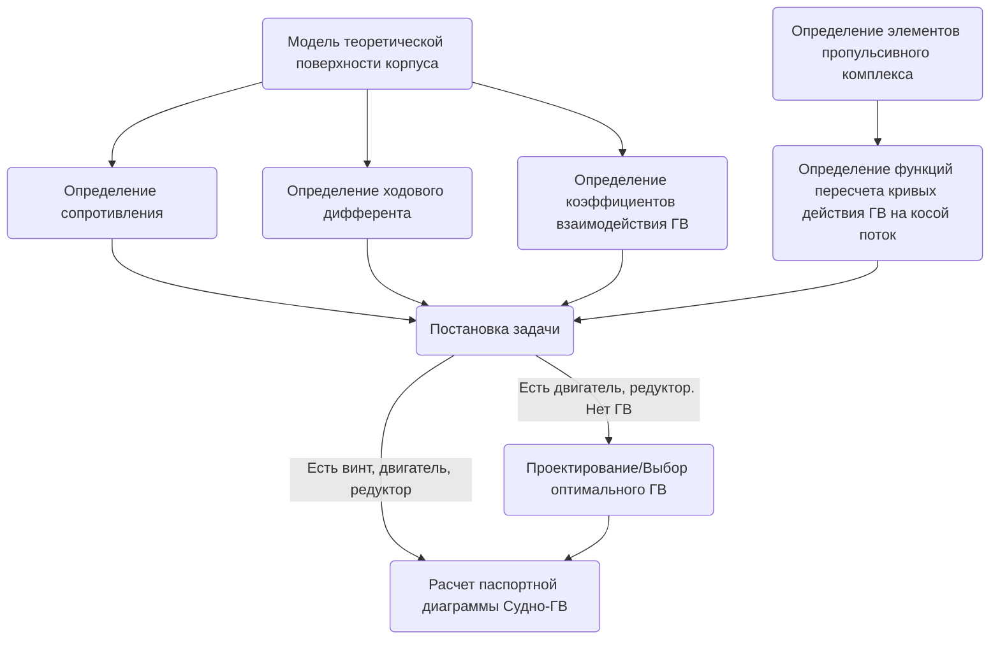

# Расчетная схема

```mermaid
flowchart TD

t4("Модель теоретической поверхности корпуса") --> ResistanceCurve("Определение сопротивления") 
t4 --> TrimCurve("Определение ходового дифферента")
t4 --> PropultionFactor("Определение коэффициентов взаимодействия ГВ")
ResistanceCurve --> WhatTask
TrimCurve --> WhatTask
PropultionFactor --> WhatTask

ChoosePropultion("Определение элементов пропульсивного комплекса") --> ObliqueFlow("Определение функций пересчета кривых действия ГВ на косой поток")
ObliqueFlow --> WhatTask("Постановка задачи")

WhatTask --> |Есть винт, двигатель, редуктор|SpeedCalc("Расчет паспортной диаграммы Судно-ГВ")

WhatTask --> |Есть двигатель, редуктор. Нет ГВ|DesignOptimalScrew("Проектирование/Выбор оптимального ГВ")
DesignOptimalScrew --> SpeedCalc

```
